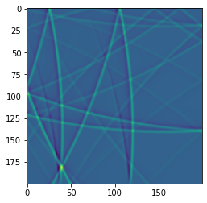
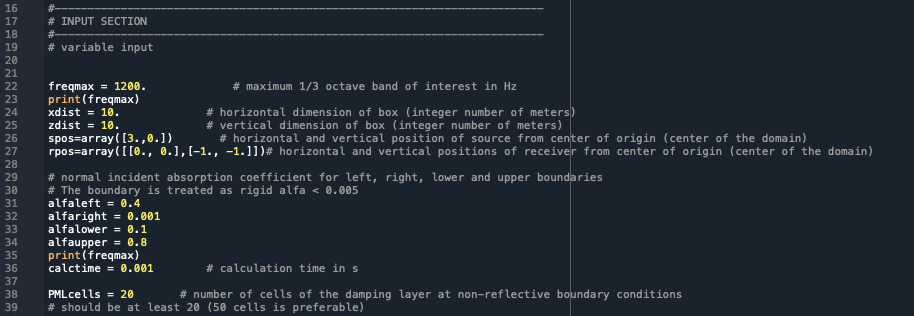

#  PSTDbox
Simple 2D PSTD sound propagation algorithm for a rectangular space.

## Motivation
The Pseudo-Spectral Time-Domain (PSTD) method is an efficient and accurate method to solve the wave equation. The extended PSTD method was published by Hornikx et al. in 2010 to apply this method to bounded problems as indoor spaces, where the boundaries can be modelled by real-valued impedances. The [openPSTD project](http://www.openpstd.org) aimed to develop a PSTD solver with GUI such that sound propagation in arbitrary 2D domains can be solved, including some limitations. The spatial domain in the openPSTD solver consists of a set of subdomains.
This algorithm is the simple version of that project, as it only solves sound propatation in a 2D rectangular domain. The key features:
- The domain dimensions and upper frequency can be changed.
- A sound source can be arbitrarily positioned in the domain.
- An impulse response can be captured at a receiver at any position in the domain. 
- The four boundaries can be assigned any sound absorption coefficient.

## Documentation
Code documentation can be found here.

## Forking and cloning
If you are a collaborator...

If you are not a collaborator...

## Installation
PSTDbox only consists of three python files, one main file: PSTD_box.py, one file containing the functions: PSTD_box_func.py, and one file containing the input variables. PSTD_box.py is the file to be run to carry our sound propagation calculations, PSTD_box.py is the file to be changed for changing input variables.
The requirements needed to run PSTDbox can be found in requirements.yml.

## Quick start
Upon running PSTD_box.py, there are several variables to change, which are as follows:
{.screenshot width="98%"}

## Testing
Two reference results are included in the test folder. They both have been generated with the Matlab script these Python codes are based on. The documents include the input section variables that are used to generate the results. 

## Reference
More information on the PSTD method can mostly be found at:
- the [openPSTD project](http://www.openpstd.org) and mostly its wiki pages
- in the paper describing the openPSTD project: Hornikx, M., Krijnen, T. and van Harten, L., 2016. openPSTD: The open source pseudospectral time-domain method for acoustic propagation. Computer Physics Communications, 203, pp.298-308.

## Recommended citation if someone uses it
The PSTDbox repository will get a dot number and made citable soon!

# licence
PSTDbox is licensed under the GPL open source license, because we think it is important for our users to have the freedom to use and adapt openPSTD freely in their academic and commercial projects. Furthermore, we believe in a collaboratively development model and we welcome contributions from other experts. 
